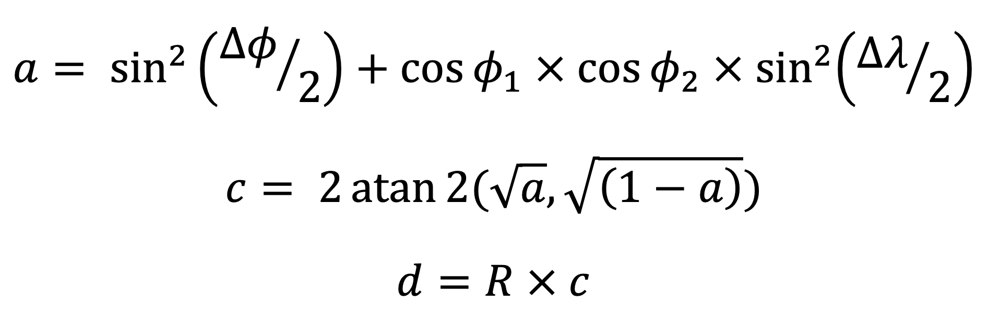

# METHOD

The following page shows the method and the workflow of the research on the prediciton problem. Namely, it includes the research questions and their significance, the hypothesis, and operational measures.

## Data imputation

Summary statistics and visualizations were generated to explore the distribution of null values in the dataset. Frequency distributions of months were visualized using bar plots and time series analysis techniques. The time series depicted in Figure 1 allows us to understand the proportion of missing values in ‘min_pressure’ and ‘wind_radii’ columns by year. For instance, as explained in the dataset description, there is no data on wind radii before 2004 and the minimum pressure recordings fluctuated dramatically until 1980. 

*Figure 1 Proportion on null values per year. The graph on the left shows the period from 1850-2022, the graph on the right is the filtered dataset from 1971 to 2022.*

Initially, the missing values for the ‘min_pressure’ variable were relatively low, comprising only approximately 3% of the data. Thus, these missing records were simply dropped from the dataset.
For the remaining variables related to wind radii measurements, which had missing values ranging around 0.78%, a linear regression approach was employed to impute these missing values. This involved using a regression model where the variables with missing values served as the target variables, and the other relevant features were utilized as predictors. The process consisted of dividing the dataset into two subsets: one containing records with missing values and another with complete records. Then, training a linear regression model using the subset of data with no missing values for the target variables. These models learned the relationships between the predictors (year, month, day, wind speed, etc.) and the target variable (wind radii measurements). The trained models were then used to predict the missing values for the target variables based on the corresponding predictor values from the subset with missing values. The missing values were replaced with the predicted values, effectively completing the dataset with imputed values. 

## Feature Engineering

Several new variables were created to enhance the analysis of hurricane data. Firstly, a variable named 'hurricane_id' was generated to uniquely identify each hurricane for every year. This identifier combines the ATCF cyclone number for that year with the year itself, as a lot of hurricanes are either unnamed or have repeated names.
One additional column was then created. First, the estimate Category variable from wind speed. This variable categorizes hurricanes into Saffir-Simpson storm categories based on their maximum sustained wind speed. Wind speed thresholds for each category were defined, and hurricanes were assigned to the corresponding category based on their wind speed. 

Moreover, a DateTime variable was created to represent the date and time of each observation. The ‘Hours_in_UTC’ column was formatted to ensure leading zeros where necessary, and the ‘Year’, ‘Month’, and ‘Day’ columns were adjusted to the proper string format with leading zeros. These columns were then combined to form the ‘DateTime’ variable, which was converted to datetime format for further analysis. The ‘Record_identifier’ variable was one-hot encoded to distinguish between hurricanes making landfall and those that did not. A binary indicator was created where landfall was coded as 1 and all other records as 0, providing a useful distinction for subsequent analyses.
Additionally, two other features were engineered to enhance the predictive capability of the model. Firstly, the nearest distance from land was calculated using the haversine formula, which computes the distance between two points on a sphere, such as the Earth. 

Where, ϕ is latitude, λ is longitude, R is earth’s radius (mean radius = 6,371km). This calculation involved converting latitude and longitude coordinates to radians and identifying the coordinate of those cyclones that have made landfall. Then, iterating through each cyclone entry and calculating the distance between the cyclone and the previously identified coordinates of land to find the minimum distance to a landfall point. The resulting distances were added as a new column in the dataset. The main limitation with this approach is that it only considers the coordinates of land where cyclones have landed before. If a cyclone is close to other bodies of land not previously struck, this approach wouldn’t identify it. Although this is very unlikely, a dataset with the coordinates of all pieces of land instead of calculating it would solve this issue. 

The second feature engineered in the process involves calculating the intensification rate, which shows the change in maximum sustained wind speed over time. Initially, the dataset is sorted chronologically by ‘DateTime’ to ensure the observations are in the correct sequence. Then, the time difference between consecutive observations is computed in hours, and the change in maximum sustained wind speed is determined accordingly. The intensification rate is then calculated by dividing the change in wind speed by the time difference. If the dataset contains infinity values due to division by zero, they are replaced with NaN. Finally, missing values are imputed using the mean value of the feature.

## Exploratory Data Analysis (EDA)

In the exploratory data analysis, various visualizations were created to gain insights into the hurricane dataset.

*Figure 2.1 A bar plots illustrating the distribution of different statuses of the hurricane system (left) and the distribution of hurricanes across different Saffir-Simpson storm categories (right).*

As the Saffir-Simpson category was calculated using the maximum sustained wind speeds, the results on Figure 2.1 right show that the real calculations involve other values of wind speed. This is evident by the lack of category 5 hurricanes. The first bar plot makes evident that most of the records are cyclones of tropical storm and hurricane intensity. 

Figures 2.2 evidence an overall increase in the trend of hurricane frequency, although fluctuating though the years, the trend appears to be increasing above the mean frequency. However, it also notes the seasonality of hurricanes, namely, the hurricane season being around September with 8000 storms recorded in the dataset (relevant to mention that it is not 8000 unique storms). Figure 2.4 also shows an important increase of landfall events in the year 2020. It also makes evident the lack of records of landfall events before the 1980s, recording Hurricane Barry (August 1983) as the first landfall event. 

*Figure 2.2: Line plot showing the frequency of hurricanes per year, and the mean frequency. Bar plot illustrating the frequency of hurricanes per month.*

*Figure 2.3: Time series plot of variation in maximum sustained wind speeds over time.*

*Figure 2.4: Time series plot to visualize landfall frequency yearly, with line of the mean number of landfall events.*

To observe patterns related to cyclone intensity before landfall, some statistical tests were performed to quantify the relationship between variables, including wind speed and pressure. Table 1 shows the results of the analysis. 
Nearest landfall distance = -6595.1392 + 2.1936 × Max sustained wind + 7.2618 × Min presure
This equation indicates how the nearest landfall distance (dependent variable) changes with changes in maximum sustained wind speed and minimum pressure (independent variables).

# Statistical Tests Results

| **Results**               |                                 |
|---------------------------|---------------------------------|
| **Pearson Correlation**    | -0.920                         |
| **T-test p-value**         | 1.28 × 10−44         |

| **OLS Regression Results**|                               |
|---------------------------|-----------------|-------------|
|                           |**Coefficient** | **p-value** |
|---------------------------|-----------------|-------------|
| **Intercept**              | -6595.14        | < 0.001     |
| **Max Wind Speed**         | 2.19            | < 0.001     |
| **Min Pressure**           | 7.26            | < 0.001     |
| **R-squared**              | 0.013           |             |
| **Adj. R-squared**         | 0.013           |             |
| **F-statistic**            | 126.1           |             |
| **Prob (F-statistic)**     | < 0.001         |             |

_Table 1: Statistical tests results_
