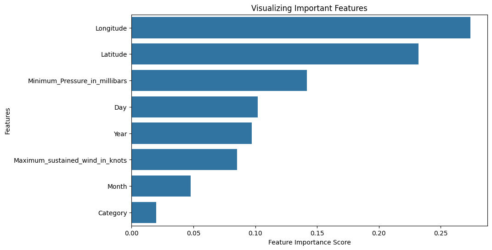
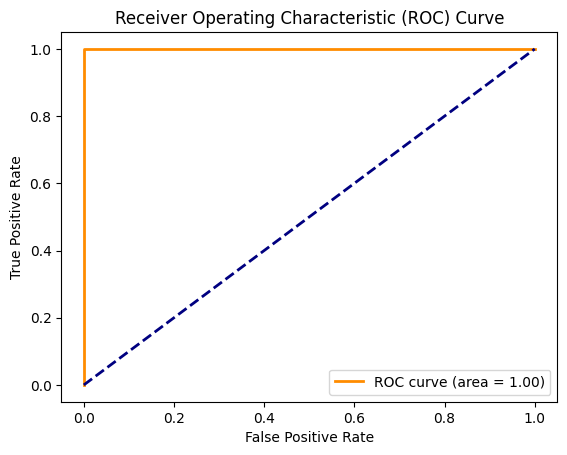
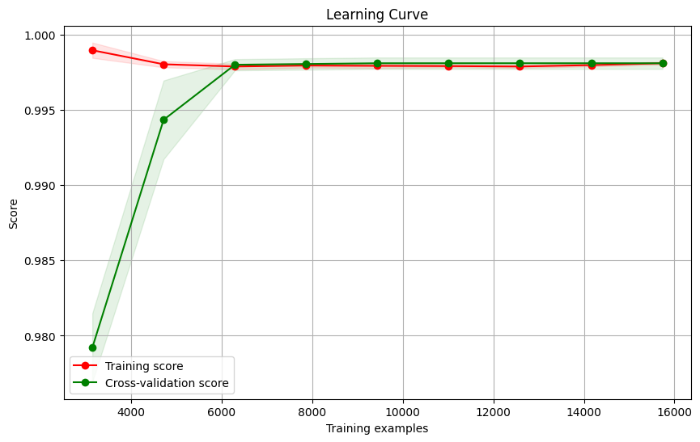
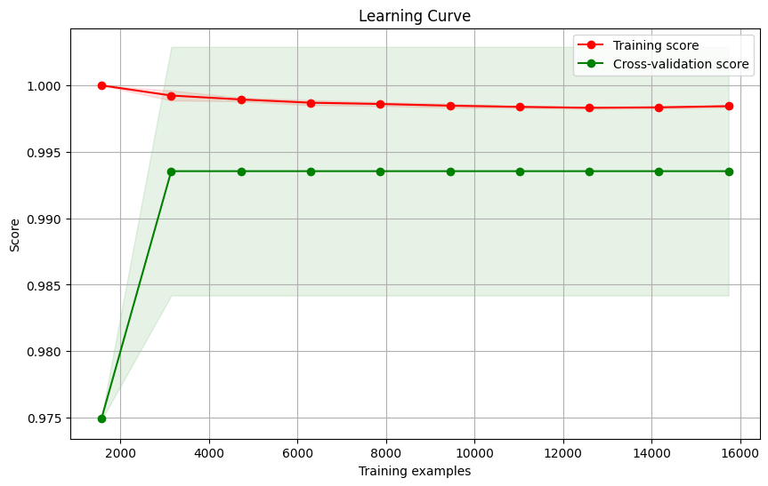
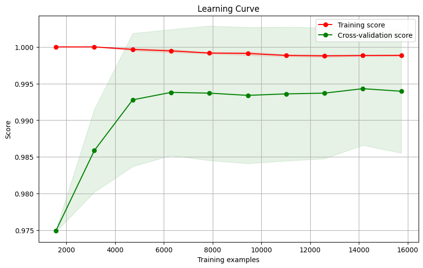

# RESULTS
This section shows how the research answers each research question based on the specific methods.

## Modeling the Probability of landfall with original variables

### Logistic Regression Model:
The logistic regression model achieved an accuracy of 0.9763, or 97.6%. While the overall accuracy seems high, the classification report reveals a concerning pattern. The precision, recall, and F1-score for the positive class (True) are all 0, indicating that the model failed to correctly predict any instances of the positive class. Conversely, the model performed well in predicting instances of the negative class (False), with high precision, recall, and F1-score. This suggests that the model is effective at identifying negative instances but fails to capture positive instances. 

### Decision Tree Model:
The decision tree model attained an accuracy of 0.9692. However, a deeper analysis of the classification report reveals a similar issue as the logistic regression model. While the model demonstrates strong performance in predicting instances of the negative class (False), with high precision, recall, and F1-score, it struggles to identify instances of the positive class (True). The precision, recall, and F1-score for the positive class are significantly lower, indicating that the model's predictive capabilities are limited. 
After hyperparameter tuning, the decision tree model's accuracy slightly improved to 0.9705. However, the fundamental issue persists. The model exhibits strong performance in predicting negative instances but remains ineffective at capturing positive instances. Despite optimizing the model's parameters, the imbalance in class distribution continues to impact its performance.

### Random Forest Model after Hyperparameter Tuning:
Similar to the logistic regression and decision tree models, the random forest model faces challenges in predicting positive instances. Despite achieving an accuracy of 0.9679, the model's precision, recall, and F1-score for the positive class are all 0, indicating a failure to correctly identify positive instances. Once again, the model excels in predicting negative instances but struggles with positive instances.

The primary concern across all models is the significant class imbalance. The dataset contains a disproportionate number of instances for the negative class compared to the positive class. With only 492 instances of the positive class compared to 19,146 instances of the negative class, the models are biased towards predicting negative instances. This imbalance severely affects the models’ ability to generalize and accurately predict positive instances.
The feature importance analysis conducted on the random forest model reveals insights into the most influential features for prediction. Figure 3 shows the overwhelming importance that longitude and latitude have on predicting the likelihood of landfall. This makes sense as the closer the tropical cyclone is to land the more likely it is to reach land at some point in its trajectory. Also, these are hurricanes solely in the Atlantic Basin, so the movement patterns are similar, as are the landfall locations.

*Figure 3: Feature importance bar plot from random forest model*

In summary, while the models demonstrate good accuracy, the score is misleading as it only scores high for negative classes, showing its inability to predict positive instances effectively due to the class imbalance.

## Modeling with engineered features

In other to effectively handle the class imbalance, two of the engineered features were added to the model. The first feature being the distance of the tropical cyclones’ position to land. The reasoning being that longitude and latitude were important features in the previous analysis and closeness to land would make sense to help indicate whether the cyclone will touch land. The second feature is the intensification rate. As previously noted, the statistical analyses suggest strong relationships between wind speed, pressure, and landfall probability, with wind speed and pressure having significant impacts on landfall distance. Thus, the intensity rate feature is included as it is engineered from the maximum wind variable. 

### Logistic Regression Model with Engineered Features:
The logistic regression model with engineered features achieved an accuracy of 99.77%. This indicates that the model correctly predicts 99.77% of the instances in the dataset. Moreover, the precision, recall, and F1-score for both classes (False and True) are very high, suggesting excellent performance in identifying both classes. Additionally, ROC curve was plotted to visualize the models’ performance in terms of true positive rate versus false positive rate, see Figure 4.1.

*Figure 4.1: ROC for Logistic Regression Model*

### Decision Tree Model with Engineered Features:
Similar to the logistic regression model, the decision tree model with engineered features demonstrates significant improvement, with an accuracy of 99.69%. The precision, recall, and F1-score for both classes have improved compared to the previous model, indicating better performance in correctly identifying both classes. After hyperparameter tuning, the decision tree model's accuracy remains high at 99.77%. The precision, recall, and F1-score for both classes also remain consistent with the previous model, demonstrating the robustness of the model's performance with engineered features.

*Figure 4.2: ROC for Decision Tree Model*

### Random Forest Model after Hyperparameter Tuning with Engineered Features:

The random forest model with engineered features achieved an accuracy of 99.77%, like the logistic regression and decision tree models. However, the precision, recall, and F1-score for the positive class (True) have substantially improved compared to the previous model, indicating enhanced performance in correctly identifying positive instances.

*Figure 4.3: ROC for Random Forest Model*

The feature importance analysis reveals that the engineered feature ‘Nearest_landfall_distance’ holds significant importance, contributing overwhelmingly to the model’s predictive power. This suggests that the proximity to landfall locations plays a crucial role in determining the occurrence of landfall. 

Finally, the learning curves were plotted for each of the models. These learning curves provide valuable insights into the performance and behavior of each model as the training dataset size increases. In the case of logistic regression, the training score remains consistently high, indicating that the model can effectively fit the training data, see Figure 5.1. However, the cross-validation score increases initially as more data is added, suggesting that the model benefits from additional training examples, likely reducing overfitting. This pattern indicates that logistic regression is robust and benefits from more data, making it a strong candidate for generalization to unseen data.

*Figure 5.1: Learning Curve of the Logistic Regression Model*

For the decision tree model, the perfect training score suggests overfitting, as the model fits the training data perfectly but struggles to generalize to unseen data, as indicated by the lower cross-validation score, see Figure 5.2. Despite efforts to tune hyperparameters, the decision tree model’s inability to consistently improve validation performance with more data suggests limitations in its ability to capture complex relationships effectively.

*Figure 5.2: Learning Curve of the Decision Tree*

Similarly, the random forest model exhibits overfitting, as evidenced by the perfect training score and the initially lower cross-validation score, see Figure 5.3. Although the model's performance stabilizes it remains lower than the training score. Considering the occasional fluctuations, the decision tree model consistency outperforms the random forest model in cross-validation. 

*Figure 5.3: Learning Curve of the Random Forest*
